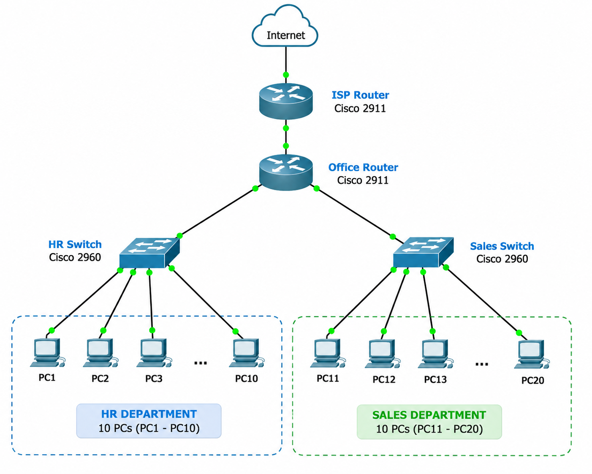
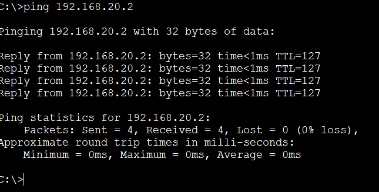

# 🌐 Small Office Network using Cisco Packet Tracer

This project demonstrates the design and implementation of a **Small Office Network** using **Cisco Packet Tracer**.

The objective of this lab is to build a basic office network, configure IP addressing, enable communication between devices, and verify successful connectivity.

---

# 📌 Project Overview

In this lab, I:

- Designed a small office network topology.
- Connected PCs to a switch using Ethernet cables.
- Configured IP addresses on end devices.
- Configured the router interface as the default gateway.
- Verified successful communication using Ping.

---

# 🖥️ Network Topology

The network consists of:

- 1 Cisco 2911 Router
- 1 Cisco 2960-24TT Switch
- 4 PCs

## Topology Diagram



---

# 🌍 IP Addressing Scheme

| Device | Interface | IP Address | Subnet Mask |
|---------|-----------|------------|-------------|
| Router | GigabitEthernet0/0 | 192.168.1.1 | 255.255.255.0 |
| PC1 | FastEthernet0 | 192.168.1.10 | 255.255.255.0 |
| PC2 | FastEthernet0 | 192.168.1.11 | 255.255.255.0 |
| PC3 | FastEthernet0 | 192.168.1.12 | 255.255.255.0 |
| PC4 | FastEthernet0 | 192.168.1.13 | 255.255.255.0 |

**Default Gateway (All PCs):**

```
192.168.1.1
```

---

# ⚙️ Configuration Summary

### Router

- Configured GigabitEthernet0/0.
- Assigned IP Address.
- Enabled the interface using `no shutdown`.

### PCs

- Assigned IPv4 Address.
- Configured Subnet Mask.
- Configured Default Gateway.

---

# ✅ Verification Commands

The following Cisco IOS command was used to verify the router configuration:

```bash
show ip interface brief
```

Connectivity was verified using:

```bash
ping
```

---

# 📷 Screenshots

## 🖥️ Network Topology


---

## ⚙️ Router Configuration


---

## 📡 Router Interface Status


---

## ✅ End-to-End Connectivity Test

Successful communication between all PCs in the network.



---

# 🎯 Learning Outcomes

After completing this lab, I learned:

- Basic Network Topology Design
- IPv4 Addressing
- Router Interface Configuration
- Default Gateway Configuration
- Basic Switch Connectivity
- End-to-End Connectivity Testing
- Cisco IOS Verification Commands
- Basic Network Troubleshooting

---

# 🛠️ Tools Used

- Cisco Packet Tracer
- Cisco IOS CLI
- Git & GitHub

---

# 💡 Key Concepts

- Small Office Network
- IPv4 Addressing
- Router Configuration
- Switch Configuration
- Default Gateway
- Ping
- Network Connectivity
- Basic Network Troubleshooting

---

# 👩‍💻 Author

**Prachi Jogdand**

🎓 BE Graduate in Computer Science & Engineering (Artificial Intelligence & Machine Learning)

🔐 Aspiring Network Engineer | Cybersecurity Enthusiast
