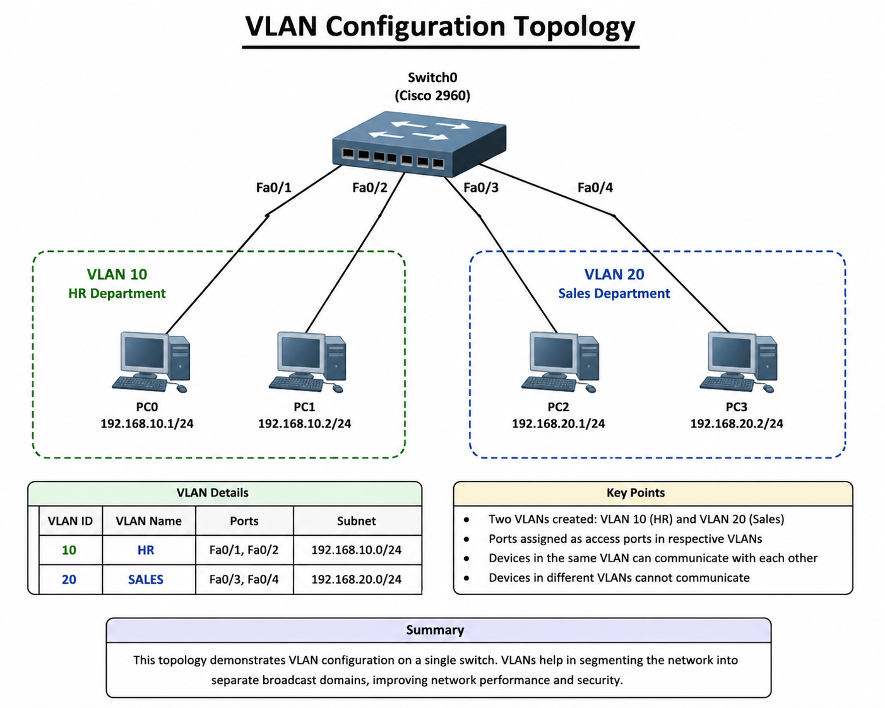
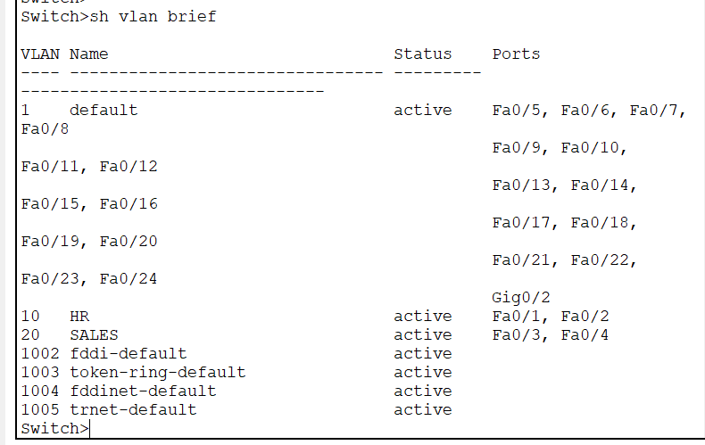
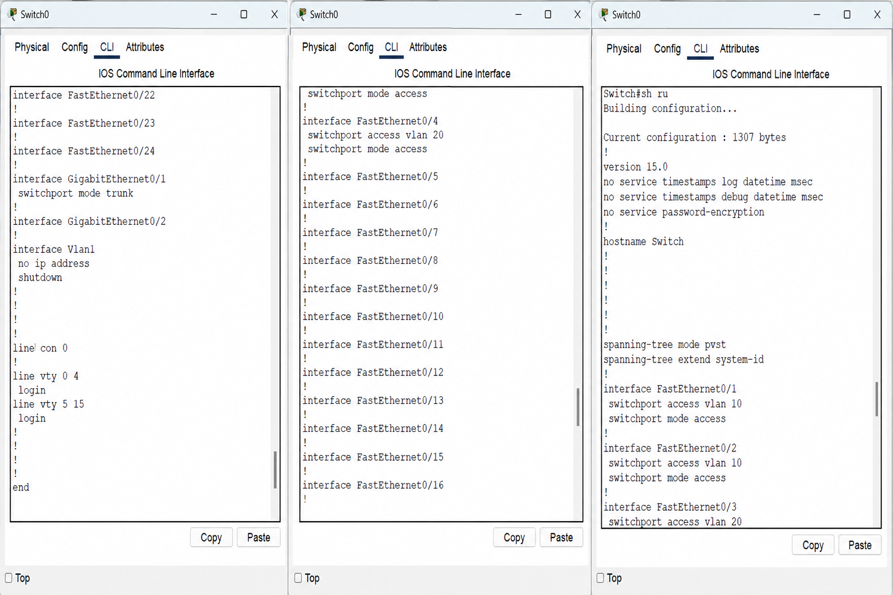
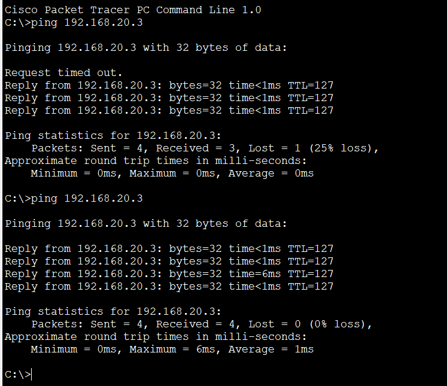

# 🔀 VLAN Configuration using Cisco Packet Tracer

## 📖 Project Overview

This project demonstrates the configuration of Virtual Local Area Networks (VLANs) using Cisco Packet Tracer.

Two departments (HR and SALES) are separated into different VLANs to improve network security, reduce broadcast traffic, and logically segment the network.

---

## 🎯 Objectives

- Create VLAN 10 (HR)
- Create VLAN 20 (SALES)
- Assign switch ports to VLANs
- Verify VLAN configuration
- Test communication within VLANs

---

## 🖥️ Network Topology

---

## 🛠️ Technologies Used

- Cisco Packet Tracer
- Cisco IOS CLI
- VLAN
- Switching
- Ethernet
- IPv4 Addressing

---

## 📦 Devices Used

| Device | Quantity |
|---------|---------:|
| Switch | 1 |
| PCs | 4 |

---

## ⚙️ Configuration

- Created VLAN 10 (HR)
- Created VLAN 20 (SALES)
- Assigned access ports to VLANs
- Verified VLAN membership using CLI

---

## ✅ Verification

### VLAN Configuration

### VLAN Commands

### Connectivity Test

---

## 📚 What I Learned

- VLAN Basics
- VLAN Creation
- Assigning Ports to VLANs
- VLAN Verification
- Network Segmentation

---

## 👩‍💻 Author

**Prachi Jogdand**

Aspiring Network Engineer | Cybersecurity Enthusiast | CCNA Learner
