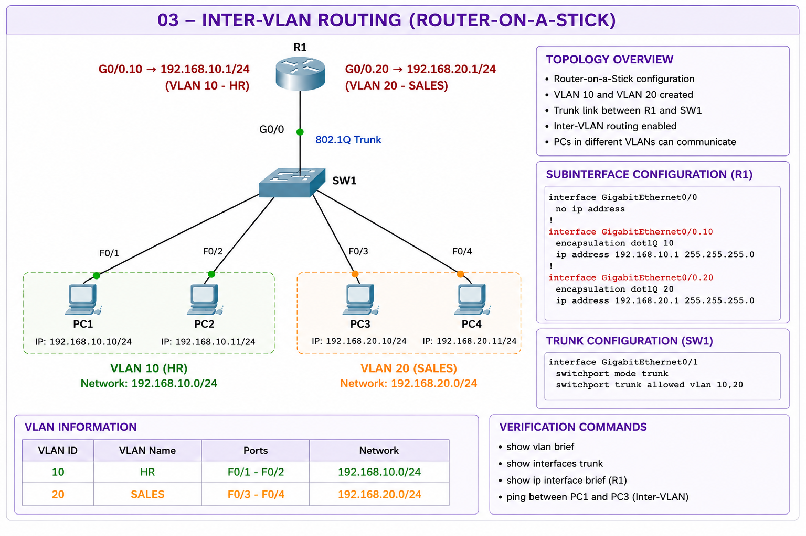
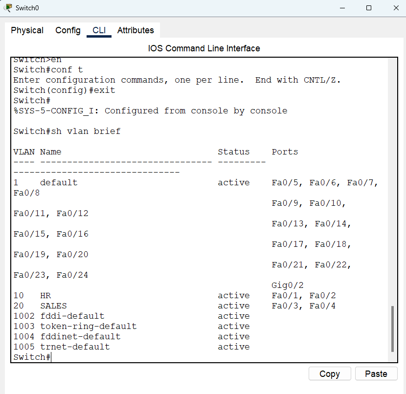
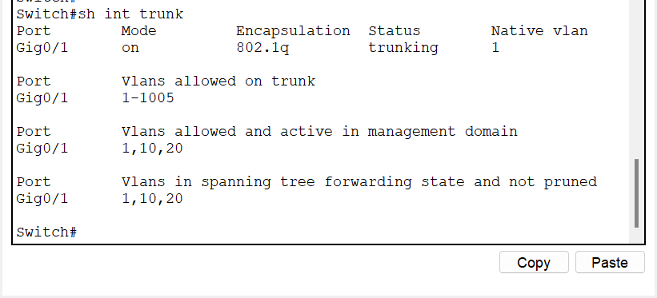
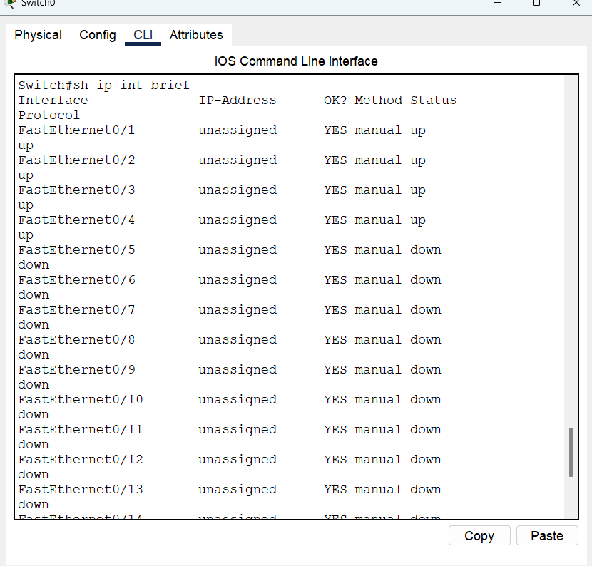
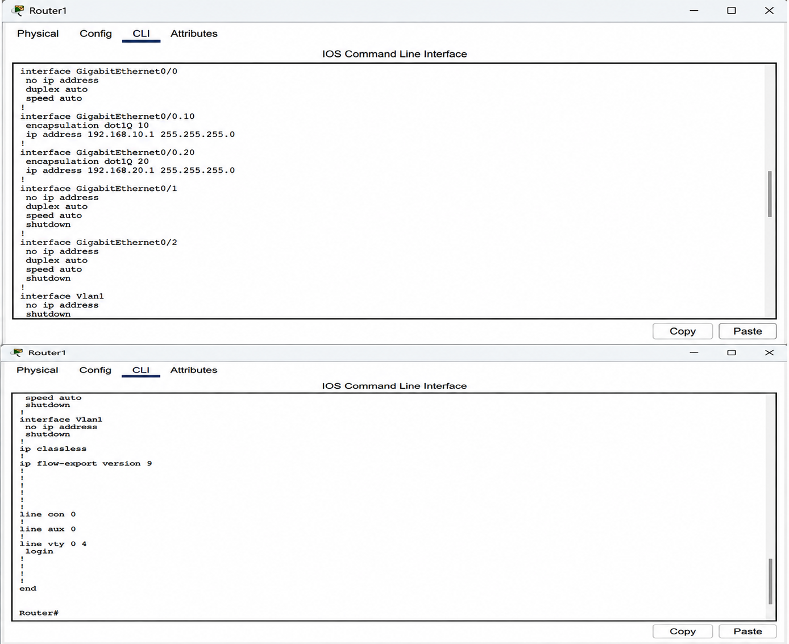
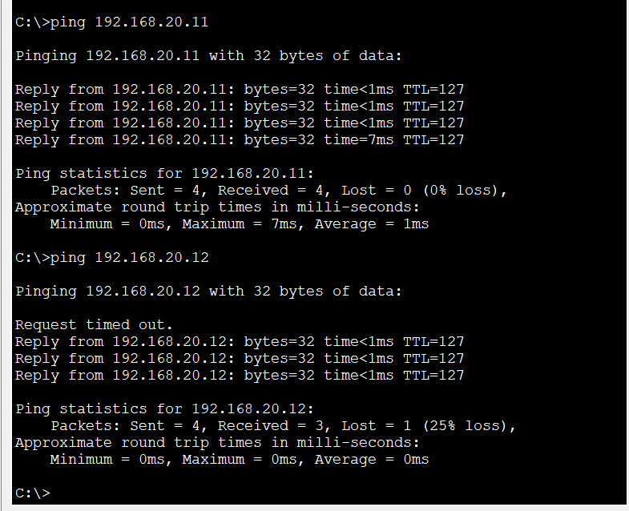

# 🔀 Inter-VLAN Routing using Cisco Packet Tracer

## 📖 Project Overview

This project demonstrates **Inter-VLAN Routing (Router-on-a-Stick)** using Cisco Packet Tracer.

Two VLANs (HR and SALES) are created on a Layer 2 switch. A router is configured with **802.1Q subinterfaces** to enable communication between devices in different VLANs.

---

## 🎯 Objectives

- Create VLAN 10 (HR) and VLAN 20 (SALES)
- Configure access ports for each VLAN
- Configure a trunk link between the switch and router
- Configure Router-on-a-Stick using subinterfaces
- Enable communication between different VLANs
- Verify network connectivity

---

## 🖥️ Network Topology

---

## 🛠️ Technologies Used

- Cisco Packet Tracer
- Cisco IOS CLI
- VLAN
- IEEE 802.1Q Trunking
- Inter-VLAN Routing
- IPv4 Addressing

---

## 📦 Devices Used

| Device | Quantity |
|---------|----------|
| Router | 1 |
| Switch | 1 |
| PCs | 4 |

---

## 🌐 VLAN Configuration

| VLAN | Name | Ports | Network |
|------|------|-------|---------|
| 10 | HR | Fa0/1 - Fa0/2 | 192.168.10.0/24 |
| 20 | SALES | Fa0/3 - Fa0/4 | 192.168.20.0/24 |

---

## ⚙️ Router Configuration

Configured Router-on-a-Stick using subinterfaces:

- GigabitEthernet0/0.10 → VLAN 10
- GigabitEthernet0/0.20 → VLAN 20
- 802.1Q Encapsulation
- Default Gateway for both VLANs

---

## 📸 Verification Screenshots

### VLAN Configuration

### Trunk Configuration

### Router Interfaces

### Router Configuration

### Connectivity Test

---

## ✅ Verification

Successfully verified:

- VLAN creation
- Trunk configuration
- Router subinterfaces
- Inter-VLAN routing
- Successful ping between VLAN 10 and VLAN 20

---

## 📚 What I Learned

- VLAN implementation
- IEEE 802.1Q trunking
- Router-on-a-Stick configuration
- Inter-VLAN communication
- Router subinterfaces
- Network troubleshooting

---

## 👩‍💻 Author

**Prachi Jogdand**

Computer Engineering | AI & ML | CCNA Networking Labs
