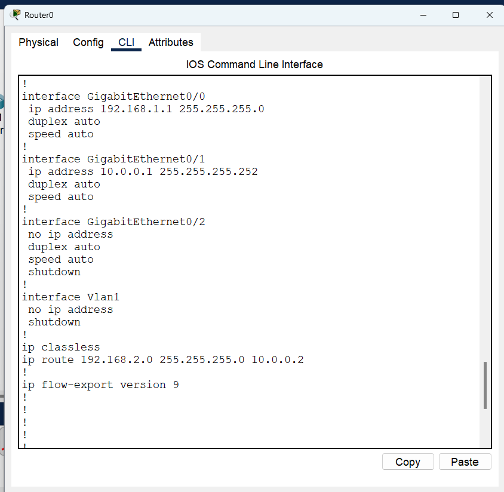
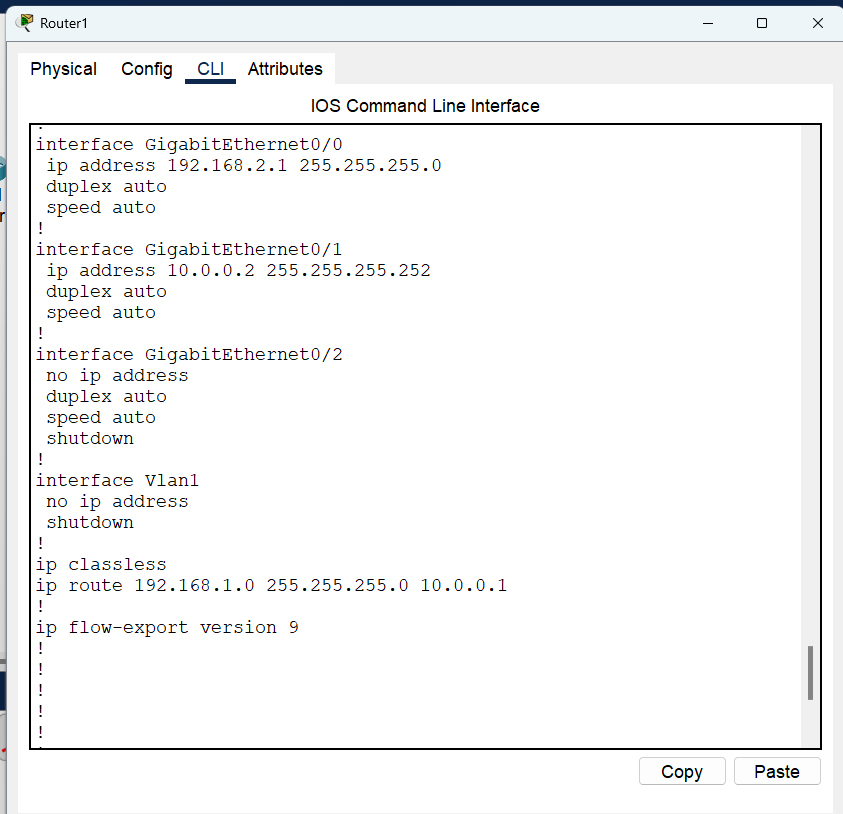
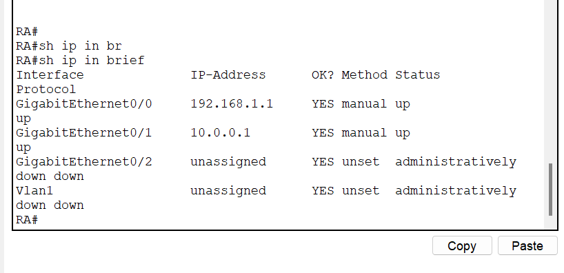
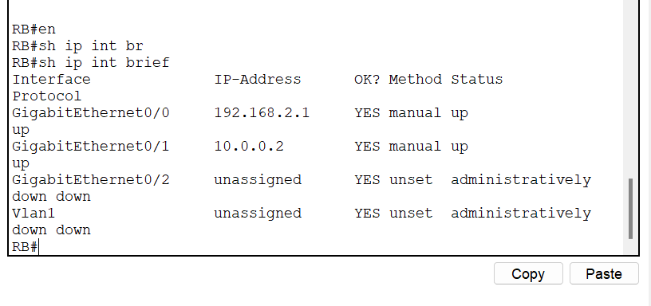
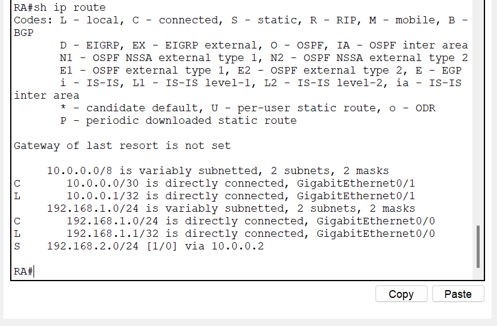
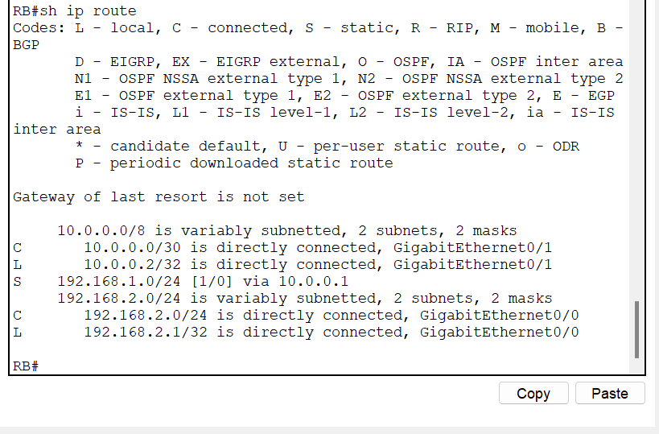
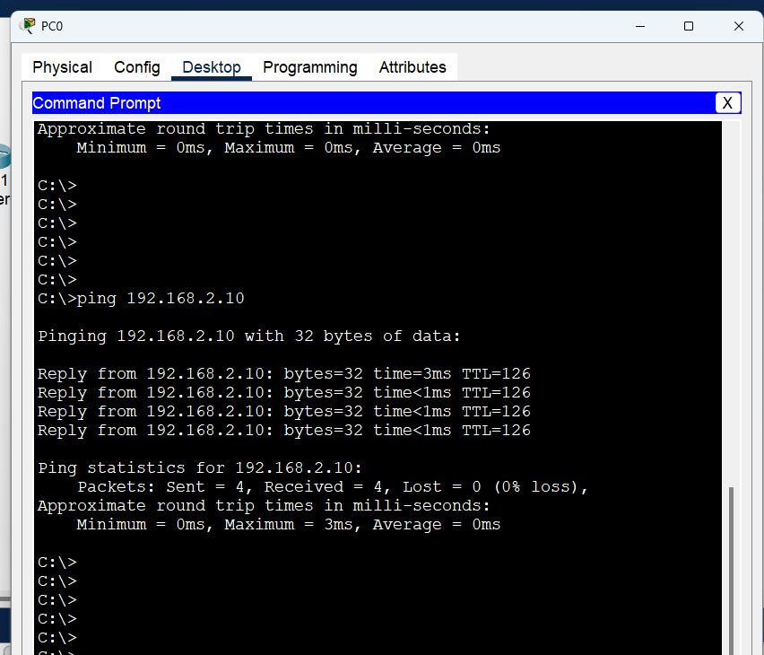

# 🌐 Static Routing using Cisco Packet Tracer

This project demonstrates the implementation of **Static Routing** between two different Local Area Networks (LANs) using **Cisco Packet Tracer**.

Static Routing is a manual routing technique where routes are configured by the network administrator. In this lab, two separate networks communicate successfully through two routers using static routes.

---

# 📌 Project Overview

In this lab, I:

- Designed a network consisting of two LANs.
- Configured IP addresses on routers and PCs.
- Connected two routers using a point-to-point network.
- Configured Static Routes on both routers.
- Verified routing tables and interface status.
- Successfully tested end-to-end connectivity using Ping.

---

# 🖥️ Network Topology

The network consists of:

- 2 Cisco 2911 Routers
- 2 Cisco 2960-24TT Switches
- 2 PCs

## 📷 Topology

<p align="center">

</p>

---

# 🌍 IP Addressing Scheme

| Device | Interface | IP Address | Subnet Mask |
|---------|-----------|------------|-------------|
| PC0 | FastEthernet0 | 192.168.1.10 | 255.255.255.0 |
| Router0 | GigabitEthernet0/0 | 192.168.1.1 | 255.255.255.0 |
| Router0 | GigabitEthernet0/1 | 10.0.0.1 | 255.255.255.252 |
| Router1 | GigabitEthernet0/1 | 10.0.0.2 | 255.255.255.252 |
| Router1 | GigabitEthernet0/0 | 192.168.2.1 | 255.255.255.0 |
| PC1 | FastEthernet0 | 192.168.2.10 | 255.255.255.0 |

---

# ⚙️ Router0 Configuration

<p align="center">

</p>

---

# ⚙️ Router1 Configuration

<p align="center">

</p>

---

# 📡 Router0 Interface Status

Command Used:

```bash
show ip interface brief
```

<p align="center">

</p>

---

# 📡 Router1 Interface Status

Command Used:

```bash
show ip interface brief
```

<p align="center">

</p>

---

# 🛣️ Router0 Routing Table

Command Used:

```bash
show ip route
```

<p align="center">

</p>

---

# 🛣️ Router1 Routing Table

Command Used:

```bash
show ip route
```

<p align="center">

</p>

---

# ✅ Connectivity Test

Command Used:

```bash
ping 192.168.2.10
```

Successful communication between **PC0 (192.168.1.10)** and **PC1 (192.168.2.10)** confirms that Static Routing has been configured correctly.

<p align="center">

</p>

---

# 🎯 Learning Outcomes

After completing this lab, I learned:

- Static Routing Fundamentals
- Router Interface Configuration
- IPv4 Address Assignment
- Router-to-Router Communication
- Point-to-Point Network Configuration
- Manual Route Configuration
- Routing Table Verification
- End-to-End Connectivity Testing
- Network Troubleshooting using Cisco IOS Commands

---

# 🛠️ Tools Used

- Cisco Packet Tracer
- Cisco IOS CLI
- Git & GitHub

---

# 💡 Key Concepts

- Static Routing
- IPv4 Addressing
- Routing Table
- Next-Hop Routing
- Router Configuration
- Ping
- Network Connectivity
- Network Troubleshooting

---

# 👩‍💻 Author

**Prachi Jogdand**

🎓 BE Graduate in Computer Science & Engineering (Artificial Intelligence & Machine Learning)

🔐 Aspiring Network Engineer | Cybersecurity Enthusiast
