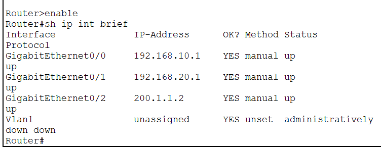
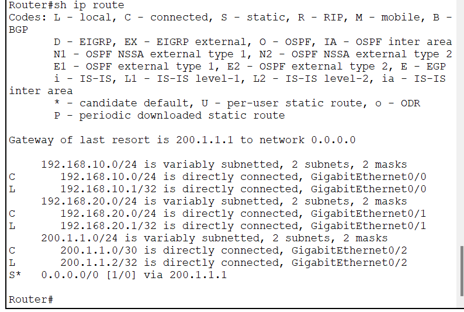
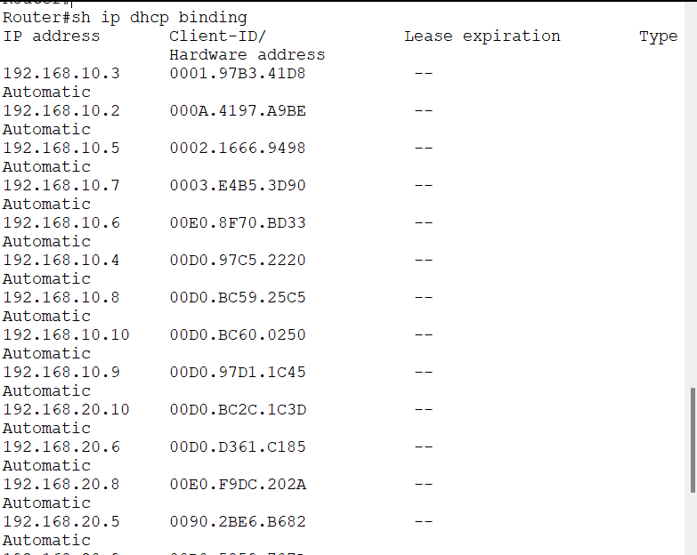

# 🌐 Small Office Network using Cisco Packet Tracer

## 📖 Project Overview

This project demonstrates the design and implementation of a Small Office Network using Cisco Packet Tracer.

The network consists of two departments connected through a router and two switches. DHCP is used for automatic IP address allocation, enabling seamless communication between different network segments.

---

## 🎯 Objectives

- Design a small office network
- Configure routers and switches
- Configure DHCP
- Assign IPv4 addresses
- Verify network connectivity

---

## 🖥️ Network Topology

---

## 🛠️ Technologies Used

- Cisco Packet Tracer
- Cisco IOS CLI
- Routing
- Switching
- DHCP
- IPv4 Addressing

---

## 📦 Devices Used

| Device | Quantity |
|--------|---------:|
| Router | 2 |
| Switch | 2 |
| PCs | 20 |

---

## ⚙️ Configuration

- Configured router interfaces
- Configured switch interfaces
- Configured DHCP
- Assigned IP addresses
- Verified connectivity

---

## ✅ Verification

### Router Interfaces

### Routing Table

### DHCP Bindings

### Connectivity Test

---

## 📚 What I Learned

- IP Addressing
- DHCP Configuration
- Router Configuration
- Switch Configuration
- Basic Network Troubleshooting

---

## 👩‍💻 Author

**Prachi Jogdand**
